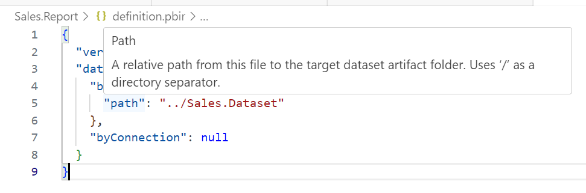
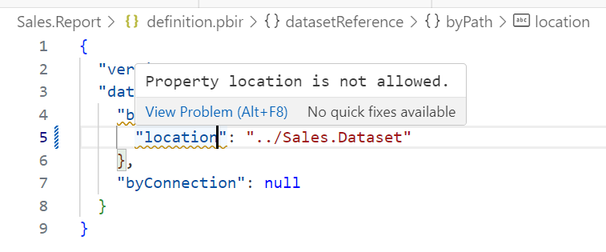
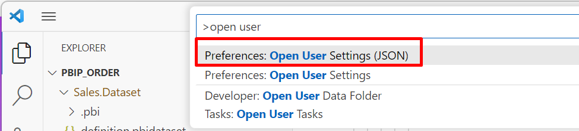

This folder contains the authoritative JSON schema files for validating item metadata files. These schemas conform to the [Draft 7 specification](https://json-schema.org/specification-links.html#draft-7) of the [JSON schema spec](https://json-schema.org/specification.html).

JSON Schemas can be used by code editors, like Visual Studio Code, and greatly improve your editing experience with Intellisense and Validation:





# Report schemas

Within the [Report schemas folder](./report/README.md), you will find JSON schemas for the Report metadata files.

# Dataset schemas

Within the [Dataset schemas folder](./dataset/README.md), you will find JSON schemas for the Dataset metadata files.

# Common schemas

Within the [Common schemas folder](./common/README.md), you will find JSON schemas for metadata files common to all items.

# How to use JSON Schemas using Visual Studio Code

You can configure Visual Studio Code to use the JSON Schemas to edit your Power BI metadata files.

Open the User settings.json by pressing F1 and search for Open User Settings (JSON)



Copy the following into the "json.schemas" property:

```json
{
    "json.schemas": [ 
        {
            "fileMatch": [
                "*.pbidataset"
            ],
            "url": "https://raw.githubusercontent.com/microsoft/powerbi-desktop-samples/main/item-schemas/dataset/definition.pbidataset-1.0.json"
        }
        ,
        {
            "fileMatch": [
                "/*.Dataset/.pbi/editorSettings.json"
            ],
            "url": "https://raw.githubusercontent.com/microsoft/powerbi-desktop-samples/main/item-schemas/dataset/editorSettings-1.0.json"
        }
        ,
        {
            "fileMatch": [
                "/*.Dataset/.pbi/localsettings.json"
            ],
            "url": "https://raw.githubusercontent.com/microsoft/powerbi-desktop-samples/main/item-schemas/dataset/localSettings-1.0.json"
        }
        ,
        {
            "fileMatch": [
                "/*.Dataset/.pbi/unappliedchanges.json"
            ],
            "url": "https://raw.githubusercontent.com/microsoft/powerbi-desktop-samples/main/item-schemas/dataset/unappliedChanges-1.0.json"
        }
        ,
        {
            "fileMatch": [
                "*.pbir"
            ],
            "url": "https://raw.githubusercontent.com/microsoft/powerbi-desktop-samples/main/item-schemas/report/definition.pbir-1.0.json"
        }
        ,
        {
            "fileMatch": [
                "/*.Report/.pbi/localsettings.json"
            ],
            "url": "https://raw.githubusercontent.com/microsoft/powerbi-desktop-samples/main/item-schemas/report/localSettings-1.0.json"
        }
        ,
        {
            "fileMatch": [
                "*.pbip"
            ],
            "url": "https://raw.githubusercontent.com/microsoft/powerbi-desktop-samples/main/item-schemas/common/pbip-1.0.json"
        }
        ,
        {
            "fileMatch": [
                "/*.Report/item.config.json"
                ,
                "/*.Dataset/item.config.json"
            ],
            "url": "https://raw.githubusercontent.com/microsoft/powerbi-desktop-samples/main/item-schemas/common/item.config-1.0.json"
        }
        ,
        {
            "fileMatch": [
                "/*.Report/item.metadata.json"
                ,
                "/*.Dataset/item.metadata.json"
            ],
            "url": "https://raw.githubusercontent.com/microsoft/powerbi-desktop-samples/main/item-schemas/common/item.metadata-1.0.json"
        }
    ]
}

```

You should also make the following file associations as JSON:

```json
{
    "files.associations": {
        "*.pbir": "json"
        ,
        "*.pbidataset": "json"
        ,
        "*.pbip": "json"
      },
}

```

To learn more, see [Editing JSON with Visual Studio Code](https://code.visualstudio.com/docs/languages/json).
