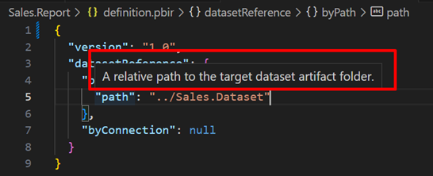

# item-schemas

This folder contains the authoritative JSON schema files for validating item metadata files. These schemas conform to the [Draft 7 specification](https://json-schema.org/specification-links.html#draft-7) of the [JSON schema spec](https://json-schema.org/specification.html).

# Item schemas

- [pbip](pbip-1.0.md)
- [item.metadata-1.0](item.metadata-1.0.md)
- [item.config-1.0](item.config-1.0.md)

# Dataset schemas

- [definition.pbidataset](dataset/definition.pbidataset-1.0.md)
- [editorSettings](dataset/editorSettings-1.0.md)
- [localSettings](dataset/localSettings-1.0.md)
- [unappliedChanges](dataset/unappliedChanges-1.0.md)

# Report schemas

- [definition.pbir](report/definition.pbir-1.0.md)
- [localSettings](report/localSettings-1.0.md)


# How to use JSON Schemas using Visual Studio Code

You can use Visual Studio Code as a code editor to author the metadata files and map the JSON schemas to the files being authored. This will permit validation, syntax highlighting, auto completion and tooltip documentation.

When authoring the document, only valid properties show up:



If a wrong property or type is specified an warning is emited:


When you hover over properties, additional context is provided:


You can directly reference the schema by adding the "$schema" property to the edited file:

```json
{
  "$schema": "https://raw.githubusercontent.com/microsoft/powerbi-desktop-samples/main/file-formats/report/ReportDefinition.json",
  "version": "1.0",
  "datasetReference": {
    "byPath": {
      "path": "../Sales.Dataset"
    },
    "byConnection": null
  }
}

```

Or by mapping the metadata files to your VS Code user settings:

```json
{
    "json.schemas": [
        {
            "fileMatch": [
                "/*.Report/*.pbir"
            ],
            "url": "https://raw.githubusercontent.com/microsoft/powerbi-desktop-samples/main/file-formats/report/ReportDefinition.json"
        }
        ,
        {
            "fileMatch": [
                "/*.Dataset/*.pbidataset"
            ],
            "url": "https://raw.githubusercontent.com/microsoft/powerbi-desktop-samples/main/file-formats/dataset/DatasetDefinition.json"
        }
        ,
        {
            "fileMatch": [
                "/*.Dataset/.pbi/editorSettings.json"
            ],
            "url": "https://raw.githubusercontent.com/microsoft/powerbi-desktop-samples/main/file-formats/dataset/DatasetEditorSettings.json"
        }
    ]
}

```